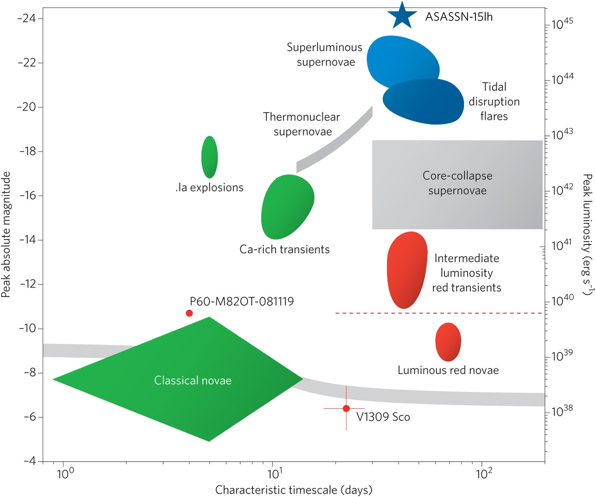

# IAIFI Astro Hackathon: Anomaly Detection

These notebooks are a starting point for hacking on anomaly/novelty detection for the IAIFI Astro Hackthon. They leverage the synthetic trnansient light curves and metadata from the [Photometric LSST Astronomical Time-Series Classification Challenge (PLAsTiCC)](https://plasticc.org/) that ran in 2018/2019.

- [Notebook 1](./notebooks/Part1_DataOverview.ipynb): Data description and exploration
- [Notebook 2](./notebooks/Part2_FeatureExtractionMethods.ipynb): Physical and non-physical feature extraction methods (using autoencoders)
- [Notebook 3](./notebooks/Part3_CustomLossFunctions.ipynb): Custom neural network loss functions for fine-tuning anomaly discovery and few-shot learning.

